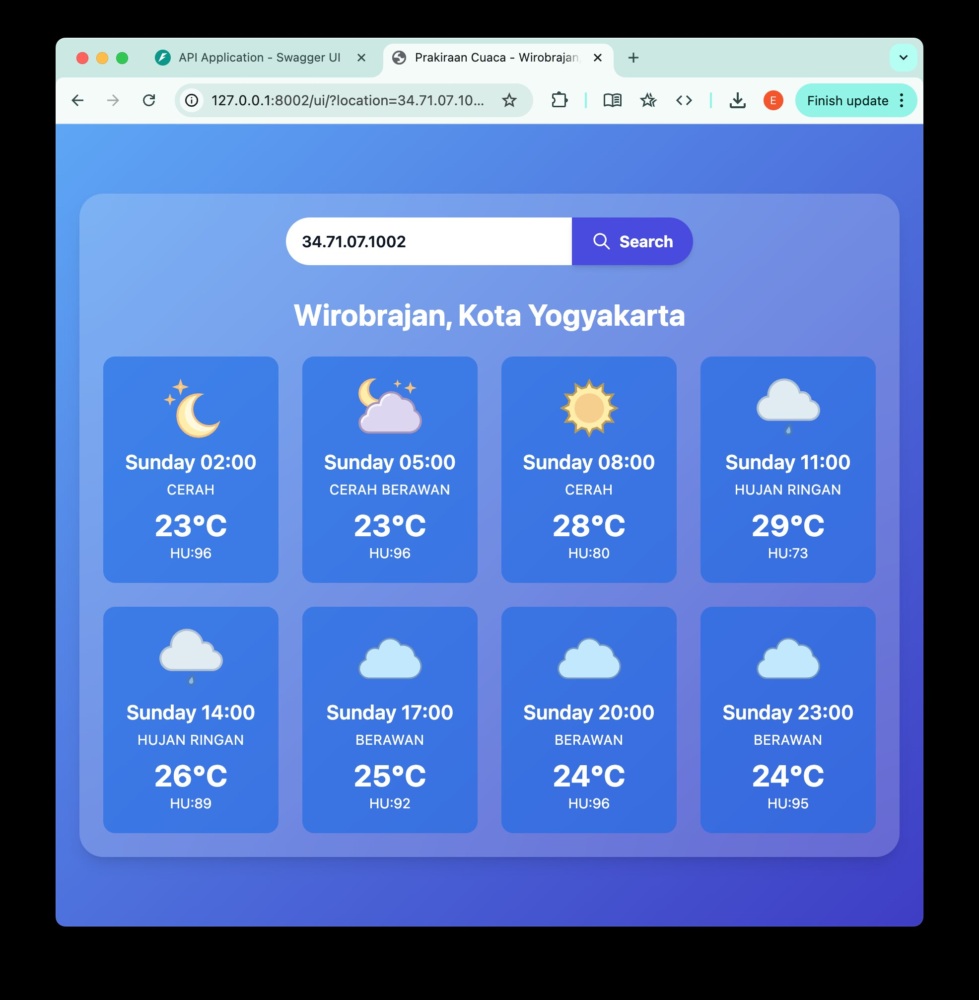

# REST API dengan FastAPI 🚀

Project ini adalah sebuah aplikasi berbasis FastAPI untuk mengelola pengguna. Aplikasi ini menyediakan endpoint untuk create, retrieve, update, dan delete data pengguna, serta mendukung fitur paginasi untuk daftar pengguna. Aplikasi ini juga menyediakan endpoint untuk mendapatkan data prakiraan cuaca yang diambil dari API BMKG. 🌦️

## Live App 🚀
Aplikasi Live bisa dilihat di:
   - Swagger Docs: [https://restapi.learn.fromindonesia.id/docs/](https://restapi.learn.fromindonesia.id/docs/)
   - UI Prakiraan Cuaca: [https://restapi.learn.fromindonesia.id/ui/](https://restapi.learn.fromindonesia.id/ui/)

## Fitur ✨

- **User Management**: Create, Retrieve, Update, dan Delete data pengguna. 👤
- **Pagination**: Menampilkan daftar pengguna dengan dukungan paginasi. 📄
- **Validation**: Validasi input menggunakan model Pydantic. ✅
- **Database Integration**: Menggunakan SQLModel untuk interaksi dengan basis data. 🗄️
- **Dependency Injection**: Manajemen sesi basis data yang disederhanakan dengan `Depends` dari FastAPI. 🔗
- **UI with TailwindCSS**: Menampilkan UI prakiraan cuaca dengan TailwindCSS. 🎨

## Struktur Project 🗂️

```bash
project/
├── app/
│   ├── core/          # Core utilities and configurations
│   ├── dto/           # Data Transfer Objects
│   ├── model/         # Pydantic models used for Database Table
│   ├── repository/    # Database interaction logic
│   ├── route/         # API route definitions
│   └── templates/     # HTML Templates
└── .env               # Environment variables
└── Dockerfile         # Dockerfile for the app
└── main.py            # Application entry point
└── Makefile           # Dockerfile for the app
└── requirements.txt   # Python dependencies
```

## Instalasi 🛠️

1. Clone Repository: 📂

   ```bash
   git clone https://github.com/repodevs/sibermu-api-project.git
   ```

   ```bash
   cd sibermu-api-project
   ```

2. Buat `.env` file 📝

   ```bash
   cp .env.example .env
   ```

   update isi dari .env jika diperlukan

3. Build and Run using Docker 🐳

   ```bash
   make buildrun
   ```

   atau

   ```bash
   docker build -t repodevs/sibermu-api-project:latest .
   ```

   ```bash
   docker run -d --name apiapp -p 8002:8002 --env-file .env repodevs/sibermu-api-project:latest
   ```

4. Akses 🌐

   - Swagger Docs: [http://localhost:8002/docs/](http://localhost:8002/docs/)
   - UI Prakiraan Cuaca: [http://localhost:8002/ui/](http://localhost:8002/ui/)

5. (opsional) Hapus Docker Container 🗑️

   ```bash
   make down
   ```

   atau

   ```bash
   docker rm -f apiapp
   ```

## Endpoints 🚪

User Endpoints

- GET `/api/v1/users`: List users with pagination. 📋
- POST `/api/v1/users`: Create a new user. ✍️
- GET `/api/v1/users/{user_id}`: Retrieve a user by ID. 🔍
- PATCH `/api/v1/users/{user_id}`: Update a user by ID. 🛠️
- DELETE `/api/v1/users/{user_id}`: Delete a user by ID. ❌


## UI Prakiraan Cuaca



## License 📜

This project is licensed under the MIT License. 🏛️

## Contributing 🤝

Contributions are welcome! Please fork the repository and submit a pull request. 🚀

## Contact 📧

For questions or support, please contact [edi20240200005@sibermu.ac.id](mailto:edi20240200005@sibermu.ac.id "send email to author"). 💌
